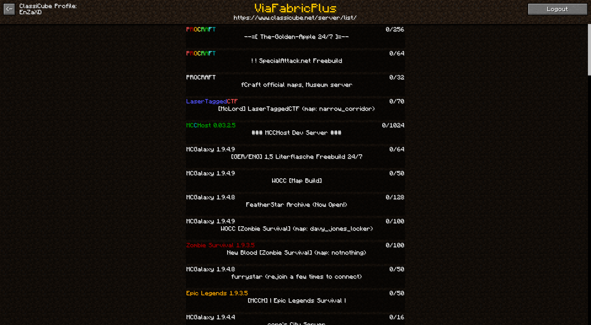
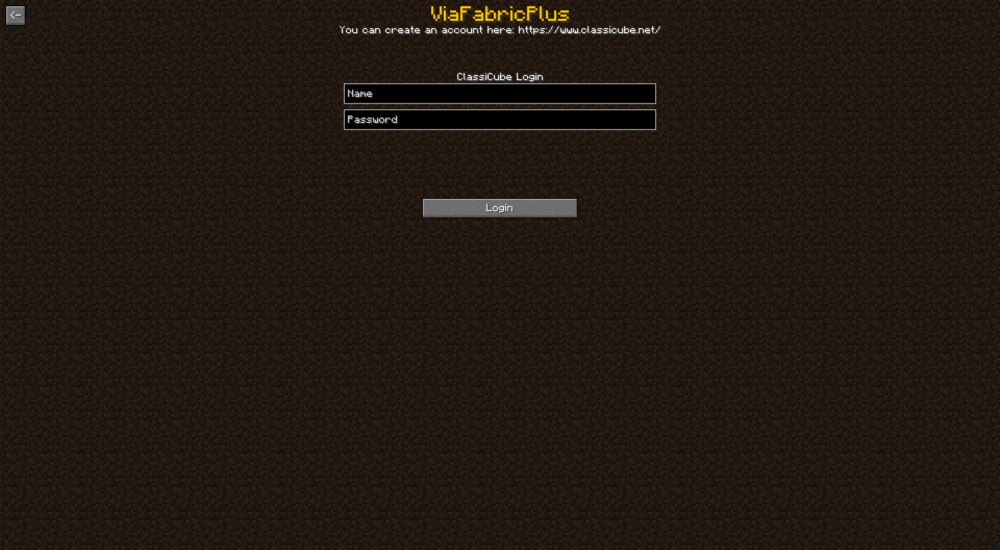

# Usage for ViaFabricPlus

## Introduction

At the top right of the multiplayer screen is the ViaFabricPlus button, with it you can enter the main menu of the mod
where you can change the settings and set the protocol version, the position of the button can be changed in the
Settings -> General -> multiplayer screen button orientation.

In the Add/Edit Server screen there is a button where you can select a specific version for this server, when you ping
or connect to this server,
ViaFabricPlus will use the version set there, the versions are stored in the servers.dat too

If you don't want to specify a specific version anymore, you can simply press the button and select **"Cancel and reset"
**.

## Commands

You can use the ViaVersion commands with **/viafabricplus** or **/viaversion**, and a few classic only commands are also
implemented:

- **/viafabricplus settime <Time (Long)>** - Changes the Clientside World Time, available from: **c0.28-c0.30**
- **/viafabricplus listextensions** - Displays all classic protocol extensions, available in: **c0.30 CPE**

### Settings 

For users only the settings in the **General**, **Bedrock**, **Authentication** and **Visual** tab are relevant, the
other settings are only for developers, you should not change the settings in the **Debug** tab if you don't know what
you are doing.

The settings are stored in the `settings.json` file. Account credentials for Bedrock/ClassiCube in `accounts.json`.

### Configuring the protocol translation libraries

To change the protocol translation settings/features you can look into the config folder. You can find 4 config files
there depending on the platforms loaded:

- `viaversion.yml` (ViaVersion)
- `viabackwards.yml` (ViaBackwards)
- `vialegacy.yml` (ViaLegacy)
- `viabedrock.yml` (ViaBedrock)
- `viaaprilfools.yml` (ViaAprilFools)

On it's first launch, ViaFabricPlus will generate the config files with proper default values. Don't touch the config
files if you don't know what you are doing.

## Debug HUD

The debug HUD can be enabled in the settings, it shows some useful information about the connection and the protocol
translation.

### Bedrock edition

Keep in mind that the Java -> Bedrock support is still in beta phase, and therefore many things are not implemented
yet and there is no guarantee that everything will work as it should.

To log in to a Bedrock account you can press the button **"Click to set account for Bedrock edition"** in the settings.

#### Bedrock Realms

If you have a Bedrock account set in the settings, you can view its Bedrock Realms in the "Server lists" screen (can be
found at the left bottom of the main GUI).

### ClassiCube and BetaCraft integration

In the main GUI there is a "Server lists" button where you can go to ClassiCube and BetaCraft server lists.

## BetaCraft

## ClassiCube

For ClassiCube you need an account, which you can make on the official website (https://www.classicube.net/), in case
ClassiCube requires MultiFactor, an extra GUI will open in ViaFabricPlus.

